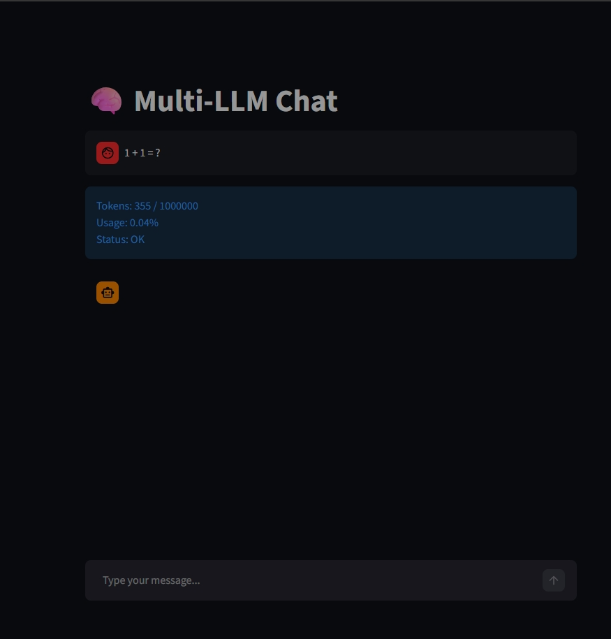
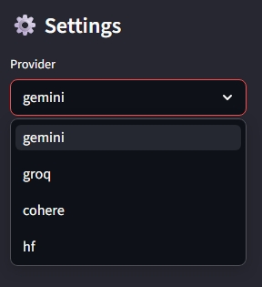
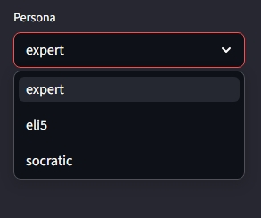
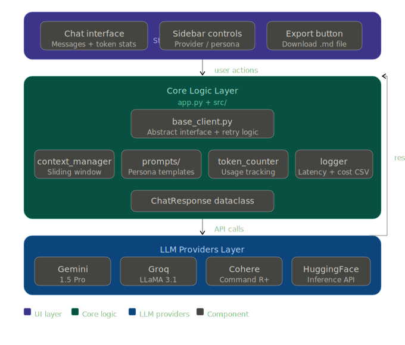
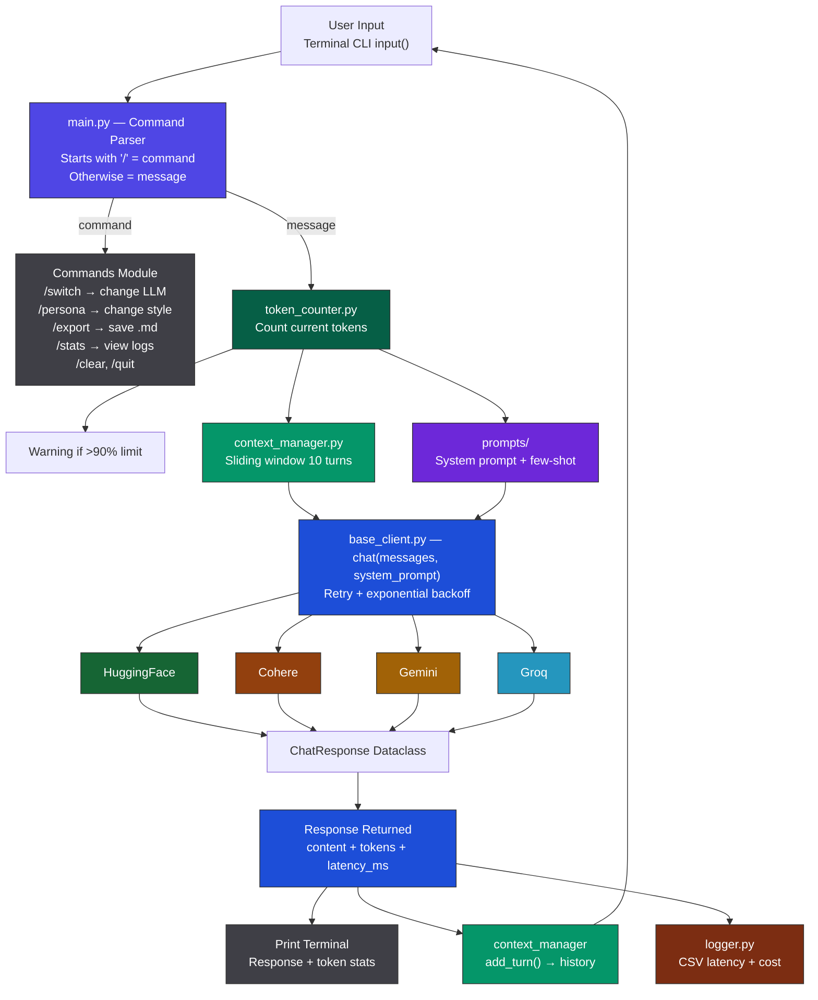

# 🤖 Multi-LLM Chatbot with Prompt Optimization

> A production-ready chatbot supporting multiple LLM providers with real-time token tracking, persona switching, and conversation management — deployed on Streamlit Community Cloud.

[](https://python.org)
[](https://streamlit.io)
[](https://ai.google.dev)
[](https://groq.com)
[](https://cohere.com)
[](https://huggingface.co)
[](LICENSE)

---

## 🌐 Live Demo

**👉 [Try it on Streamlit →](https://multi-llm-chatbot-6jvnvduqjhztvj3f9d3ued.streamlit.app/)**

> ⚠️ You will need to provide your own API keys in the sidebar to use the app.

---

## 📸 Screenshots

<!-- Replace with your actual screenshots -->
| Main Chat Interface | Provider Switching | Persona Selection |
|---|---|---|
|  |  |  |

---

## 📋 Overview

This project is a **multi-provider LLM chatbot** that demonstrates practical prompt engineering techniques and production-level software design patterns. It allows users to interact with four different LLM providers within a single conversation, switching seamlessly while maintaining context.

**What makes this different from a basic chatbot:**
- Supports 4 LLM providers with a unified interface via the Abstract Factory pattern
- Implements 3 prompt engineering techniques as switchable personas (ReAct, Zero-shot, Chain-of-Thought)
- Real-time token tracking with context window usage percentage
- Sliding window conversation memory — keeps the last 10 turns to stay within context limits
- Full conversation export to Markdown
- Request logging: latency and estimated cost per turn

---

## ✨ Features

### Multi-Provider Support
Switch between providers mid-conversation without losing history:

| Provider | Model | Context Window | Strength |
|---|---|---|---|
| **Google Gemini** | models/gemini-flash-latest | 1,000,000 tokens | Long context, multimodal |
| **Groq** | llama-3.3-70b-versatile | 128,000 tokens | Ultra-fast inference |
| **Cohere** | command-r7b-12-2024 | 128,000 tokens | RAG-optimized, grounded |
| **HuggingFace** | deepseek-ai/DeepSeek-V4-Pro | 32768 | Open-source models |

### Prompt Engineering Personas
Three distinct response styles, each applying a different prompting technique:

| Persona | Technique | Best For |
|---|---|---|
| **Expert** | ReAct (Reason + Act) | Technical deep-dives, structured analysis |
| **ELI5** | Zero-shot instruction | Explaining complex concepts simply |
| **Socratic** | Chain-of-Thought | Learning through guided questioning |

### Conversation Management
- **Sliding window memory:** Automatically keeps the 10 most recent turns
- **Token counter:** Displays `tokens used / context limit (%)` after every response
- **Export to Markdown:** Save full conversation with metadata, timestamps, and per-turn stats
- **Session statistics:** Total tokens, estimated cost, latency breakdown by provider

### Reliability
- **Exponential backoff retry:** Automatically retries on rate limit errors (1s → 2s → 4s)
- **Graceful error handling:** No unhandled exceptions — errors display inline without crashing the app
- **Input validation:** Prevents sending empty messages or switching to invalid providers

---

## 🏗️ Architecture




```
multi-llm-chatbot/
│
├── llm_client/
│   ├── base_client.py          # Abstract base class + ChatResponse dataclass
│   ├── gemini_client.py        # Google Gemini API wrapper
│   ├── groq_client.py          # Groq API wrapper
│   ├── cohere_client.py        # Cohere API wrapper
│   └── huggingface_client.py   # HuggingFace Inference API wrapper
│
├── prompts/
│   ├── templates.py            # PersonaType enum + system prompts
│   └── few_shot_examples.py    # Few-shot examples per persona
│
├── utils/
│   ├── token_counter.py        # Token counting per provider
│   ├── context_manager.py      # Sliding window + export logic
│   └── logger.py               # CSV logging: latency + cost
│
├── streamlit_app.py            # Streamlit UI entry point
├── config.py                   # Constants, model names, limits
└── requirements.txt
```

**Key design decision:** Each LLM client inherits from `BaseClient` (Abstract Factory pattern). The app layer only calls `client.chat()` — adding a new provider requires zero changes to existing code.

---

## 🧠 Prompt Engineering Details

### Expert Persona — ReAct Pattern
The system prompt instructs the model to structure responses as:
```
[THOUGHT]     → Analyze the current situation
[ACTION]      → Decide what to do next
[OBSERVATION] → Record the result
[FINAL ANSWER]→ Deliver the conclusion
```
This mirrors the ReAct (Reason + Act) technique from the research literature, forcing the model to show its work before concluding.

### ELI5 Persona — Zero-Shot Instruction
The system prompt instructs the model to structure responses as:
```
[ANALOGY]     → Start with a simple comparison
[EXPLANATION] → Explain using short simple sentences
[EXAMPLE]     → Give a familiar real-life example
[SUMMARY]     → End with a tiny recap
```

### Socratic Persona — Chain-of-Thought
The system prompt instructs the model to structure responses as:
```
[ACKNOWLEDGE] → Recognize the user's effort
[BREAKDOWN]   → Split the problem into small steps
[GUIDE]       → Ask a guiding question
[REFLECT]     → Reveal inconsistencies indirectly
[FOLLOW-UP]   → Continue the reasoning process
```
This follows the Socratic + Chain-of-Thought guidance approach, helping users discover answers through guided reasoning instead of direct solutions.

---

## 🚀 Getting Started

### Prerequisites
- Python 3.10+
- API keys for the providers you want to use (at least one)

### Local Setup

**1. Clone the repository**
```bash
git clone https://github.com/lequanganhtuan/Multi-llm-chatbot.git
cd Multi-llm-chatbot
```

**2. Install dependencies**
```bash
pip install -r requirements.txt
```

**3. Set up environment variables**
```bash
cp .env.example .env
# Edit .env and add your API keys
```

**4. Run the app**
```bash
streamlit run streamlit_app.py
```

### Environment Variables
```
GOOGLE_API_KEY=your_gemini_key
GROQ_API_KEY=your_groq_key
COHERE_API_KEY=your_cohere_key
HUGGINGFACE_API_KEY=your_hf_key
```

> You only need keys for the providers you plan to use. The app detects which providers are available based on which keys are set.

### Using the Streamlit Cloud Demo
1. Open the [live demo link](https://share.streamlit.io/)
2. Login or register (recommend using github),
3. Create app, add api key in secret setting folder and deploy
4. Start chatting

---

## 📊 How Token Tracking Works

After each response, the app displays:
```
📊 Tokens: 1,247 / 128,000 (0.97%) | ⏱ 1,234ms | 💰 ~$0.0048
```

Token counting uses provider-specific methods:
- **Gemini:** `response.usage_metadata.prompt_token_count`
- **Groq:** `response.usage.prompt_tokens` (OpenAI-compatible)
- **Cohere:** `response.meta.tokens.input_tokens`
- **HuggingFace:** Estimated via HuggingFace tokenizer

When context usage exceeds 90%, the app warns the user before sending the next message.

---

## 📁 Conversation Export

Use the **Export** button to download the full conversation as a Markdown file:

```markdown
# Conversation Export
Date: 2024-01-15 10:30:00
Provider: Groq (llama-3.1-70b)
Persona: Expert
Total Turns: 8

---

## Turn 1
**User:** Explain transformer attention...

**Assistant (Groq | Expert):**
[ANALYSIS] The attention mechanism...
[REASONING] This matters because...
[CONCLUSION] In short...

*Tokens: 120 input / 350 output | Latency: 340ms*
```

---

## 📈 Session Statistics

The Stats panel shows a breakdown of the current session:

```
Session Statistics
──────────────────────────────────
Total Turns     : 12
Total Tokens    : 8,420
Estimated Cost  : ~$0.031

Provider Breakdown:
  Groq          : 7 turns | 340ms avg latency
  Gemini        : 3 turns | 1,200ms avg latency
  Cohere        : 2 turns | 890ms avg latency

Persona Breakdown:
  Expert        : 8 turns
  Socratic      : 4 turns
──────────────────────────────────
```

---

## 🔧 Adding a New Provider

The Abstract Factory pattern makes it straightforward to add a new LLM provider:

1. Create `llm_client/new_provider_client.py` inheriting from `BaseClient`
2. Implement `chat()`, `get_model_name()`, `get_context_limit()`, `get_provider_name()`
3. Add the new provider to `config.py`
4. Register it in `app.py`'s provider selector

No changes needed to `context_manager.py`, `logger.py`, or prompt templates.

---

## 🧪 What I Learned

Building this project deepened my understanding of several practical concepts:

**Prompt Engineering in practice** — Writing system prompts that reliably produce structured outputs (ReAct format) is harder than it looks. The Expert persona required several iterations before the [ANALYSIS]/[REASONING]/[CONCLUSION] structure was consistently followed across all providers.

**Provider differences matter** — Each API has a different message format, error type, and token counting method. Abstracting these behind a unified interface isn't just good design — it's necessary to avoid spaghetti code when handling 4 providers.

**Context window management** — Sliding window is the simplest solution but has a real trade-off: the model loses context from earlier in the conversation. A smarter approach would be summarization of older turns, which would be a natural next step.

**Latency vs. capability trade-off** — Groq is dramatically faster than Gemini for similar-quality outputs on many tasks. This became obvious when building the stats panel — average latency for Groq was ~340ms vs. ~1,200ms for Gemini.

---

## 🗺️ Potential Improvements

- [ ] Streaming responses (token-by-token display)
- [ ] Conversation summarization for older turns beyond the sliding window
- [ ] RAG integration — attach documents for Cohere's grounded generation
- [ ] Side-by-side provider comparison mode
- [ ] Cost budget alerts — warn when estimated cost exceeds a threshold
- [ ] Conversation branching — fork from any point in history

---

## 📄 License

MIT License — see [LICENSE](LICENSE) for details.

---

## 🙏 Acknowledgements

- [Streamlit](https://streamlit.io) for the deployment platform
- [Google AI Studio](https://ai.google.dev) for Gemini API access
- [Groq](https://groq.com) for fast inference
- [Cohere](https://cohere.com) for Command R+
- [HuggingFace](https://huggingface.co) for open-source model access

---

*Built as part of an AI Engineering learning curriculum — Week 8: LLM APIs & Prompt Engineering*
